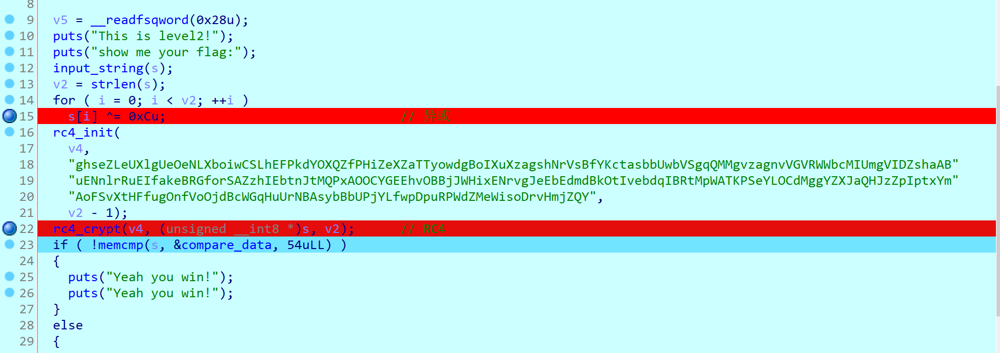

# 三叶草二进制第二次面试优秀解题报告

三叶草技术小组二进制方向第二次技术面试一共有七道常规 CTF 逆向题目，本次面试主要面向大一新同学，主要考察面试同学的逆向基础功底以及学习能力。

我们选择的知识点有三部分

1. 基础知识 (异或、静态分析、动态调试、base64)
2. 学校课堂正在学习的知识（C语言、线性代数矩阵乘法）
3. 没有接触过的知识（二叉树、C++异常、AES除列混合部分）

对于未接触过的知识，我们给出了详细的学习链接以及学习指导。

经过一个星期的解题时间，我们一共收到 23 份报告，其中 6 份报告完成所有考核题目（5份大一新生，1份研究生新生）


这篇 writeup 糅合了来自七位同学的解题报告

题目下载: https://github.com/SycloverTeam/SycBinINTVW2021.git

## Level 1

解题人 :  混入 21de 蒟蒻

SYC{PHQGlZhgsHfoFUWHUfExCUtJKxYeWJcuZvMwkrIENjSCAEwdyyRpHodDYa}

### 题目分析

开始前先贴一张我分析的笔记~~（ 鞭尸我自己，过程不是这样分析的 ）~~


最开始拿到题目的时候天真的我还没有考虑到事情的严重性，还想手动 Battle 一下双重循环的一个异或，还傻乎乎的以为在动调下发现了什么大秘密，结果我错了~~（ 数据变化太怪了 ）~~

突然想起来异或是一个可逆的加密过程，有原理 ：

> 若 C = A ^ B,
>
> 则有 A ^ C == B 
>
> A ^ B == C 
>
> C ^ B == A  
>
> A ^ A == 0 
>
> B ^ B == 0
>
> 异或一般用于加密 加密过程: 
>
> 明文 ^ 密钥 == 密文 	解密过程: 密文 ^ 密钥 == 明文

这个时候我才想起来为什么要手动推演这个复杂的异或~~（高达62*57次运算）~~，因为异或在二进制下相当于加法，同时存在上述的可逆过程，那么我们直接逆向化解题目不就可以得到 flag 了吗？

在解题过程中我们将 level 1 拖入 IDA 中可以看到如下的代码：


我们简易分析其组成，可以了解到输入的数据长度为 63 ，在两个 for 的加持（循环）下得到加密的后的 `s[i]`，并在最后和`compare_data[k]`进行比较，那么我们的突破口便是对这个`compare_data[k]`进行反推其输入（`s[i]`），因为异或逆运算还是异或，我们举个例子：`A^B=C` 那么 C 便是我们这个题目中异或后的结果，我们将 C 异或回去，`C ^ B = ? ` 这个问号是不是就是我们的 A 。由此我们进入汇编层，提取对应`compare_data[k]`的数据：


之后我们便可以开始编写脚本了。


### 题目解答

我们根据异或可逆的性质直接反异或回去就是我们想要的输入（ flag ），于是我们编写对应脚本如下：

```c++
#include<iostream>
#include<cstring>
#include<cmath>
using namespace std;
int main() {
	char s[] = {
		0x89, 0x81, 0x0D, 0x37, 0x92, 0x88, 0x27, 0x33, 0x86, 0xB2,
		0xF6, 0xFB, 0x61, 0x58, 0xE0, 0xEB, 0x7C, 0x6D, 0xF9, 0xE4,
		0x77, 0x46, 0x93, 0xAC, 0x09, 0x1D, 0x8A, 0xB6, 0x39, 0x08,
		0xBF, 0x81, 0xCD, 0xD2, 0x6D, 0x79, 0xD8, 0xF6, 0x7B, 0x43,
		0xC1, 0xDA, 0x17, 0x19, 0x9C, 0xBA, 0x15, 0x07, 0xBB, 0xBD,
		0x19, 0x08, 0x9B, 0x99, 0xC4, 0xE4, 0x42, 0x67, 0xDA, 0xF8,
		0x6B, 0x51, 0xDB
	};


	char v1 = -85;
	int v2 =  0;
	for ( int i = 0; i <= 62; ++i ) {
		for ( int j = 0; j <= 57; ++j ) {
			v1 ^= j ^ v2 ^ 0xDA;
			s[i] ^= s[(i + 1) % 63];
			s[i] ^= v1;
			++v2;
		}
	}
	
	puts(s);
	return 0;
}
```

运行成功后便是我们想要的输入啦！


## Level2

解题人: sanyic

IDA64打开，发现进行了异或和RC4加密


除去常规的编写脚本逆向外，对于特殊的情景可以有其他的思路。

我们可以先找到最后用于比较的数据，由于两步运算都属于对称性质的加密，对比较数据再加密就相当于解密。

开始动态调试



从 memcmp 函数可以得知最后的检验有 54 个字符


在输入时先输入54 个填充数据 (替换掉输入的 a )，再用 lazyida 进行填充（部分数据可能对应不可见字符，无法直接输入，需要靠 lazyida 在调试过程中插入）


填充结束后，执行加密代码，可以得到 s 的结果如下: 


Flag：SYC{TOLSLFhyGZWaONYrPfZWRvTCmmKoUYNdfvjbQCCpaUBgsEnTQ}


解这道题主要是利用了 RC4 加密和解密过程一致，加密解密函数都是相同的函数，我们将密文数据提取出来作为输入再加密一次即可得到明文。


## level3

解题人: 孙永琪

### 程序逻辑 (代码+文字描述)：

```c
input_string(v1);
base64_encode(v1,s1.33);
if(!memcmp(s1,s2,44uLL))
    puts("Yeah you win!!!! ~~");
```

从此可看出程序逻辑大致为，输入 flag，将 flag 进行 base64 加密，最后将加密后的数据与目标数据进行比对。

可从中看出本题 flag 长度应为 33，而 s2 的数据可通过IDA调试获得。

在这里我们不对此处的加密函数进行具体分析，转而从base64加密的底层逻辑出发：

base64 编码将三个字符对应的ASCII码的二进制数据由 3X8 的形式拆分为 4X6 的形式然后进行变化加密。那么显然，无论中间的算法有多么复杂，中间发生了何种变换，**一定可以找到最初的六位二进制数据与加密后数据的一一对应关系**，即可找到对应的破译表，而破译表中数据的获取可通过IDA进行调试获得。

### 解题脚本：

鉴于笔者能力有限，下面仅提供一些比较基础的获取破译数据的方法：

### 1.散弹打鸟型

用 IDA 打开题目文件，在如下位置设置断点：


进行调试，输入自己需要转化的数据，以“aaa”为例：

| 原数据                |    a     |    a     |    a     |
| --------------------- | :------: | :------: | :------: |
| 对应ASCII码二进制数据 | 01100001 | 01100001 | 01100001 |

| 拆分后 | 011000 | 010110 | 000101 | 100001 |
| ------ | :----: | ------ | :----: | ------ |

随后查看 s1 的值：


即可得到破译后的数据：

| 拆分后 | 011000 | 010110 | 000101 | 100001 |
| :----: | :----: | :----: | :----: | :----: |
| 加密后 |   E4   |   DF   |   B3   |   33   |

接下来就是重复类似过程，可根据破译表缺失的部分灵活调整输入值以获取所需数据。

然而，上述方法在破译过程中很容易出现数据的重复收集而导致效率的降低，而且面对一些特殊值譬如000000，不易直接找到其对应字符，下面提供另一种方法：

### 2.精准打击型

打如下两个断点：


然后进行调试，输入v1值（此处可随意输入）后，双击v1查看其地址：


接下来使用 IDApython 脚本：

利用指令 idc.patch_dbg_byte(va, value) 直接对 v1 的值进行修改，具体的修改值可通过如下方法得到：

```c
#include <stdio.h>
int main(void)
{
	unsigned char a[] = { 0B00000000,0B00010000,0B10000011,0B00010000,0B01010001,0B10000111,0B00100000,0B10010010,0B10001011,0B00110000,0B11010011,0B10001111,0B01000001,0B00010100,0B10010011,0B01010001,0B01010101,0B10010111,0B01100001,0B100101101,0B00110110,0B11100011,0B10101111,0B00111111,0B00000100,0B00110001,0B01000111,0B00100100,0B10110011,0B01001111,0B01000101,0B00110101,0B01010111,0B01100101,0B10110111,0B01011111,0B10000110,0B00111001,0B01100111,0B10100110,0B10111011,0B01101111,0B11000111,0B00111101,0B01110111,0B11100111,0B10111111,0B0111111 };
	for (int i = 0; i <= 47; i++)
	{
		printf("%d\n", a[i]);
	}
	return 0;
}
```

得到修改值如下：


接下来对v1中的值依次进行修改，修改完成后继续调试过程，然后将s1的数据导出即可得到对应的破译数据，最终得到的破译表如下：


而已知 s2 的数据与破译表，进行破译即可得到最初的数据，取 s2 前四位数据为例：

| s2               |   67   |   3F   |   07   |   58   |
| ---------------- | :----: | :----: | :----: | :----: |
| 破译后二进制数据 | 010100 | 110101 | 100101 | 000011 |

| 最初对应的ASCII码 | 01010011 | 01011001 | 01000011 |
| :---------------: | :------: | :------: | :------: |
|     对应字符      |    S     |    Y     |    C     |

接下来对数据依次进行破译后即可轻松解出此题 FLAG：

```c
#include <stdio.h>
int main(void)
{
	char a[] = { 0B01010011,0B01011001,0B01000011,0B01111011,0B01011001,0B01001000,0B01011000,0B01010110,0B01000001,0B01100011,0B01101010,0B01101010,0B01110000,0B01000111,0B01110011,0B01000010,0B01101100,0B01100110,0B01010100,0B01011010,0B01110111,0B01010001,0B01101011,0B01000110,0B01001011,0B01101111,0B01010111,0B01000110,0B01010111,0B01101110,0B01110010,0B01101110,0B01111101 };
	for (int i = 0; i <=32; ++i)
	{
		printf("%c", a[i]);
	}
	return 0;
}
```

最终得到 FLAG 为：SYC{YHXVAcjjpGsBlfTZwQkFKoWFWnrn}

## level4

解题人: 乔雪飞-bj777-空信212

先看壳，64 位 ELF 文件。


我们拖到 ida64 中查看：


我们先动态调试一样看看大概的过程，我们在17行设断点，运行到19行，需要输入flag，输入完后狂点F8进程结束。


然后我们再来分析一下程序，我们输入的字符串如果不等于64字节，直接exit了，接下来是两个for循环的嵌套，我们可以将其理解为一个矩阵，for 循环作用是把 s    矩阵中的每一位对应赋值给 v9，注意还有可能创建一个转置矩阵，但出题人比较善良，并没有创建转置矩阵。

接下来是 v10 的数组，再经过下面的运算，这个运算不难理解，是矩阵的相乘，如果该矩阵可逆，直接用逆矩阵解就好。

```c++
for ( k = 0; k <= 7; ++k )
  {
    for ( m = 0; m <= 7; ++m )
    {
      v5 = 0;
      for ( n = 0; n <= 7; ++n )
        v5 += v9[8 * k + n] * v10[8 * m + n];
      	v10[8 * k + 64 + m] = v5；

​     }

}
```


最后是 **v10[8 * ii + 64 + jj] != compare_data_origin[8 * ii + jj]** 相比，相等就成功了，这个可以作为一个判定条件，其实就是比较两个矩阵相等。

注意，这个 64 是扩大了原有 v10[64] 这个数组的长度，即将v10[64] ——> 变为v10[128],不能理解成将v5赋值到v10[64]中，这样的话会直接使矩阵每一项的值减少许多，自然就是错的。

这里简单介绍一下z3库的应用

用 pip install z3-solver 进行安装。

1.创建一个解的声明对象：

```
s = Solver() 
```

2.添加条件（用来约束）：

```
s.add()
```

3.判断是否有解：

```
s.check()
```

如果有解 则反回sate 反之 返回 unsate

4.返回最后的解：

```
result=s.modul()
print(result)
```

解释一下：BitVec 是字符按位运算，Int 是整形运算，判定的条件是前4个字符是‘SYC{’，最后一个字符是‘}’，本来还写了字符范围在A~Z,a~z，0~9，但师傅说不用。这个确实没必要，不会加快太多运算时间，而且有可能会因为多余的条件而导致出错！其中 assert 是断言，如果有运行错误会报错，是个不错的工具。as_long是将数据转换为 long 型，我自认为我的脚本没问题，所以听取了师傅的意见，代入flag的值，通过动态调试和脚本输出v10进行对照，如果一致说明没问题，不一致就有问题。我试了一下，有很大问题，值与值之间差的太多了，我在想为什么这样呢，于是我把目光转移到我少加的64身上，再次修改程序，我将com的范围扩大，变成128再次计算：

```python
from z3 import*
com=[ 381577, 378457,416889,326926,325667, 540807, 421653,408152,408162,391355,448648,330989,337540,569136,426635,397366,409633,428646,436722,346431,351918, 598158,483727,412569,411737, 424856, 454133, 336707, 360004,603891, 478253,438105, 422590, 444061, 448356,334117,360072,583110,481152,398828,479850,471394,
487198,373201,381606,650664,521561, 477718,397042,383879,393727, 288971,300614, 498219,402029,336256,420724,437969,472300,350451,377490,614352,488650,421868 ]
v10=[860,626,469,427,981359,733,115,279,431,807,413,581,670,748,714,412,298,993,716,389,464,772,879,667,216,221,367,869,151,223,425,188,327,732,319,454,500,758,922,902,423,784,518,798,998,854,426,559,734,496,159,780,959,796,527,894,306,817,112,781,699,181,0,0,0,0,0,0,0,0,0,0,0,0,0,0,0,0,0,0,0,0,0,0,0,0,0,0,0,0,0,0,0,0,0,0,0,0,0,0,0,0,0,0,0,0,0,0,0,0,0,0,0,0,0,0,0,0,0,0,0,0,0,0,0,0]
s=Solver()
flag=[Int('flag%d'%i) for i in range(64)]

begin ="SYC{"
for i in range(len(begin)):
       s.add(flag[i] == ord(begin[i]))
s.add(flag[63] ==ord('}'))
v9 = [0 for _ in range(64)]
for i in range(8):
    for j in range(8):
        v9[i*8+j] = flag[i*8+j]
for k in range(8):
    for l in range(8):
        v5=0
        for m in range(8):
            v5+=v9[8*k+m] * v10[8*l+m]
        v10[8*k+64+l] =v5
for ii in range(8):
       for jj in range(8):
              s.add(v10[8*ii+64+jj] == com[8*ii+jj])
assert(s.check() == sat)

m = s.model()
res = []
for i in range(64):
    res.append(chr(m[flag[i]].as_long()))
s=''.join(res)
print(s)
```


其中 join 是让字符串连起来。


成功得到flag！！！

**SYC{CvKAdyBlVDBjPlLFNtgzPsGtAcigBKhVlzamOvftexzOLNyIoDHMfUNhLla}**

## level5

解题人: gxh

### 程序逻辑

一个简化版的魔改 AES，直接手逆即可


### 秘钥拓展

由固定的v5秘钥先进行秘钥拓展，得到固定的 v11，直接 lazyida 提取 v11 就行


### 加密部分

#### 加密的第一部分

输入的48个字符分成3组，一组16个，与 v8 进行异或，，第一轮给的 v8 是固定的，从第二轮开始，v8就等于上一轮上次一加密之后的flag16个字符

#### 加密的第二部分

对16个字符进行简化的aes加密，大致分三步，第一步轮秘钥加，就是与秘钥进行异或，第二步进行字节代换，就是拿16个字符的每一个字节作为下标，去取S盒中该下标的元素进行代换，第三步进行行移位


行移位伪代码及其图解


## 解题思路

他分三块加密，我们就分三块逆向呗


### 整体逆向过程

行移位逆向 -> 字节代换逆向 -> 异或秘钥 -> 异或上一轮密文


### 行移位逆向

直接一个一个还原回去就行了，随便拿一组行移位举例子

```python
b2[0] = cmp3[0]
b2[1] = cmp3[13]
b2[2] = cmp3[10]
b2[3] = cmp3[7]
b2[4] = cmp3[4]
b2[5] = cmp3[1]
b2[6] = cmp3[14]
b2[7] = cmp3[11]
b2[8] = cmp3[8]
b2[9] = cmp3[5]
b2[10] = cmp3[2]
b2[11] = cmp3[15]
b2[12] = cmp3[12]
b2[13] = cmp3[9]
b2[14] = cmp3[6]
b2[15] = cmp3[3]
```


### 字节代换逆向

也是随便拿一组举例

```python
for k in range(16):
    b2[k] = SBOX.index(b2[k])
```


### 其他逆向

剩下的就是一些简单的异或逆向了，就不单独写了


### 解题脚本

```python
SBOX = [0x28, 0x90, 0xC3, 0x41, 0xC2, 0x75, 0x84, 0xDA, 0x79, 0xE7, 0x21, 0x0C, 0x81, 0xD5, 0xBF, 0x92, 0xB8, 0x4E, 0xB1, 0x2D, 0xED, 0x5C, 0xCB, 0x99, 0x6A, 0x32, 0x6F, 0xF2, 0x52, 0x4D, 0x29, 0x77, 0x49, 0x1D, 0xBB, 0x3A, 0x9F, 0x02, 0x1A, 0x71, 0x58, 0x72, 0xBA, 0xA1, 0x5E, 0xFA, 0x48, 0xF9, 0xFC, 0xF7, 0xA6, 0x97, 0x9D, 0x24, 0x0D, 0xE0, 0xF3, 0x37, 0x08, 0xEA, 0xF5, 0x6B, 0x86, 0xEF, 0x8D, 0x61, 0x65, 0x17, 0xD7, 0x7E, 0x13, 0x9C, 0xCC, 0x12, 0x33, 0x8E, 0x7D, 0x2F, 0x55, 0xCA, 0xAB, 0xE4, 0xFE, 0x45, 0xD6, 0xF6, 0xDE, 0xF1, 0x67, 0xE1, 0x0B, 0xB2, 0xAE, 0xCF, 0x7C, 0x04, 0x0E, 0x16, 0xA2, 0x00, 0xC6, 0xFF, 0x2C, 0x1E, 0x47, 0x30, 0xA4, 0x40, 0x4B, 0x15, 0x38, 0x35, 0xAF, 0x3E, 0x39, 0x3C, 0xD2, 0x85, 0xC7, 0x64, 0x89, 0xFD, 0xE8, 0x8B, 0x43, 0xC8, 0x22, 0x94, 0xA8, 0x31, 0xA3, 0xB9, 0x20, 0xEB, 0xB0, 0x01, 0x3D, 0x68, 0x5A, 0x93, 0x5B, 0x4F, 0x50, 0xE6, 0x6D, 0xF4, 0x44, 0x10, 0x80, 0xA7, 0x51, 0xD3, 0xC4, 0x2B, 0x88, 0x95, 0xA5, 0x70, 0x23, 0x18, 0x09, 0x4A, 0x19, 0x66, 0xDC, 0xEC, 0x14, 0xA9, 0xDB, 0xE2, 0x91, 0x4C, 0x57, 0x82, 0x1B, 0x2A, 0x11, 0x7B, 0x5D, 0x8A, 0xD4, 0xA0, 0x07, 0xD8, 0x53, 0x9B, 0x26, 0xD1, 0x98, 0x42, 0x0A, 0x9A, 0x1C, 0x8F, 0x5F, 0x63, 0xE9, 0xCD, 0xC1, 0x1F, 0x6C, 0xCE, 0xAC, 0xAA, 0xD0, 0x7F, 0x59, 0xBE, 0xB6, 0x46, 0xB7, 0x83, 0xEE, 0x7A, 0x9E, 0xC5, 0x62, 0x60, 0xF0, 0x8C, 0x2E, 0xC0, 0xDD, 0x73, 0x56, 0x76, 0x27, 0xB5, 0x25, 0x74, 0x6E, 0xC9, 0xDF, 0xB4, 0x34, 0x05, 0xD9, 0xB3, 0xBD, 0x3B, 0x54, 0xAD, 0x0F, 0x87, 0x78, 0xFB, 0x69, 0xF8, 0xBC, 0xE3, 0x96, 0x03, 0x3F, 0xE5, 0x06, 0x36]

v8 = ['v', 'M', 'B', 'i', 'x', 'p', 's', 'w', 'D', 'V', 'g', 'J', 'h', 'p', 'Z', 'd']
for i in range(len(v8)):
    v8[i] = ord(v8[i])

v11 = [0x58, 0x2F, 0x36, 0xDD, 0x92, 0xF2, 0x79, 0x09, 0xC8, 0x73, 0x6F, 0x0A, 0x36, 0x14, 0x6F, 0x43, 0xB7, 0x1A, 0x21, 0xD0, 0x25, 0xE8, 0x58, 0xD9, 0xED, 0x9B, 0x37, 0xD3, 0xDB, 0x8F, 0x58, 0x90, 0x55, 0x7D, 0x4C, 0x5C, 0x70, 0x95, 0x14, 0x85, 0x9D, 0x0E, 0x23, 0x56, 0x46, 0x81, 0x7B, 0xC6, 0x6C, 0xF6, 0x8D, 0x4F, 0x1C, 0x63, 0x99, 0xCA, 0x81, 0x6D, 0xBA, 0x9C, 0xC7, 0xEC, 0xC1, 0x5A, 0xA5, 0x79, 0x86, 0x50, 0xB9, 0x1A, 0x1F, 0x9A, 0x38, 0x77, 0xA5, 0x06, 0xFF, 0x9B, 0x64, 0x5C, 0x10, 0xBF, 0x28, 0x66, 0xA9, 0xA5, 0x37, 0xFC, 0x91, 0xD2, 0x92, 0xFA, 0x6E, 0x49, 0xF6, 0xA6, 0x42, 0xD6, 0x3C, 0x5E, 0xEB, 0x73, 0x0B, 0xA2, 0x7A, 0xA1, 0x99, 0x58, 0x14, 0xE8, 0x6F, 0xFE, 0x1D, 0xE3, 0x3A, 0xB3, 0xF6, 0x90, 0x31, 0x11, 0x8C, 0x31, 0xA8, 0x49, 0x98, 0xD9, 0xC7, 0xB7, 0x66, 0xFC, 0xE2, 0x77, 0x90, 0x6C, 0xD3, 0x66, 0x1C, 0x5D, 0x7B, 0x2F, 0x84, 0x84, 0xBC, 0x98, 0x70, 0x64, 0x26, 0x57, 0xE0, 0x08, 0xF5, 0x31, 0xFC, 0x55, 0x8E, 0x1E, 0x78, 0xD1, 0x32, 0x86, 0x36, 0xC2, 0x96, 0xDE, 0xD6, 0xCA, 0x63, 0xEF, 0x2A, 0x9F, 0xED, 0xF1, 0x52, 0x4E, 0xDF, 0x77, 0x63, 0xB1, 0xF2, 0x20, 0xB5, 0x7B, 0x91, 0xCF, 0x9F, 0xE4, 0x7C, 0x3E, 0xCD, 0xAA, 0xA3, 0x49, 0xF2, 0xD7, 0xE0, 0x5F, 0x47, 0xAC, 0x71, 0x90, 0xD8, 0x48, 0x0D, 0xAE, 0x15, 0xE2, 0xAE, 0xE7, 0xD5, 0xCC, 0x29, 0x03, 0x92, 0x60, 0x58, 0x93, 0x4A, 0x28, 0x55, 0x3D, 0x5F, 0xCA, 0xFB, 0xDA, 0x79, 0xCF, 0xD9, 0x07, 0xEB, 0xAF, 0x81, 0x94, 0xA1, 0x87, 0xD4, 0xA9, 0xFE, 0x4D, 0x2F, 0x73, 0x56, 0x36, 0xE5, 0x01, 0xBD, 0x99, 0x64, 0x95, 0x1C, 0x1E, 0xB0, 0x3C, 0xE2, 0x53, 0x9F, 0x4F, 0x13, 0x2E, 0x2F, 0x26, 0xAE, 0xB7, 0x4B, 0xB3, 0xB2, 0xA9, 0xFB, 0x8F, 0x50, 0xFA, 0x64, 0xC0, 0x85, 0xE8, 0x33, 0x8D, 0x2B, 0x5F, 0x78, 0x3E, 0x99, 0xF6, 0x83, 0xB1, 0xC9, 0x0C, 0xE7, 0x71, 0x04, 0x21, 0x0D, 0x43, 0x2F, 0x7E, 0x75, 0x7D, 0xB6, 0x88, 0xF6, 0xCC, 0x7F, 0x84, 0x11, 0xBD, 0x24, 0x6F, 0x4F, 0xD7, 0x0B, 0x11, 0x3A, 0xAA, 0xBD, 0x99, 0xCC, 0x66, 0xC2, 0x1D, 0xDD, 0xDB, 0x69, 0xAF, 0xC3, 0x88, 0x62, 0xBE, 0xF9, 0x22, 0xDF, 0x27, 0x35, 0x44, 0x1D, 0x3A, 0xE8, 0x9F, 0x61, 0x70, 0xDB, 0xC5, 0x03, 0xCE, 0x22, 0xE7, 0xDC, 0xE9, 0x17, 0xA3, 0xC1, 0xD3, 0xFF, 0x3C]
print(len(v11))

cmp3 = [0xDE, 0xF6, 0xA7, 0xB8, 0xF5, 0xD2, 0xF9, 0xFE, 0xD9, 0xA0, 0x13, 0xF3, 0x43, 0xEF, 0xB2, 0x8A]
cmp2 = [0x2E, 0xC3, 0xC3, 0x5F, 0x1E, 0x1C, 0x43, 0xE9, 0x1E, 0xE1, 0xB9, 0xBD, 0x85, 0x5B, 0x7A, 0x39]
cmp1 = [0xF8, 0x88, 0x9D, 0x31, 0xC7, 0x24, 0xD5, 0xF9, 0x45, 0x28, 0x9B, 0x7D, 0x42, 0x66, 0x65, 0x29]
b2 = [0] * 16

flag1 = ''
flag2 = ''
flag3 = ''

#v11[0]-v11[352]
#第一组解密
p = 336 #352-16
for i in range(1):
    b2[0] = cmp3[0]
    b2[1] = cmp3[13]
    b2[2] = cmp3[10]
    b2[3] = cmp3[7]
    b2[4] = cmp3[4]
    b2[5] = cmp3[1]
    b2[6] = cmp3[14]
    b2[7] = cmp3[11]
    b2[8] = cmp3[8]
    b2[9] = cmp3[5]
    b2[10] = cmp3[2]
    b2[11] = cmp3[15]
    b2[12] = cmp3[12]
    b2[13] = cmp3[9]
    b2[14] = cmp3[6]
    b2[15] = cmp3[3]

    for k in range(16):
        b2[k] = SBOX.index(b2[k])

    for j in range(16):
        b2[j] ^= v11[p]
        p += 1

b3 = [0] * 16
p = 320#336-16
for i in range(21):
    b3[0] = b2[0]
    b3[1] = b2[13]
    b3[2] = b2[10]
    b3[3] = b2[7]
    b3[4] = b2[4]
    b3[5] = b2[1]
    b3[6] = b2[14]
    b3[7] = b2[11]
    b3[8] = b2[8]
    b3[9] = b2[5]
    b3[10] = b2[2]
    b3[11] = b2[15]
    b3[12] = b2[12]
    b3[13] = b2[9]
    b3[14] = b2[6]
    b3[15] = b2[3]

    for z in range(16):
        b2[z] = b3[z]

    for k in range(16):
        b2[k] = SBOX.index(b2[k])
    p = 320 - i * 16
    for j in range(16):
        b2[j] ^= v11[p]
        p += 1

for i in range(16):
    b2[i] ^= cmp2[i]

flag3 = bytes(b2).decode()


#第二组解密
p = 336
for i in range(1):
    b2[0] = cmp2[0]
    b2[1] = cmp2[13]
    b2[2] = cmp2[10]
    b2[3] = cmp2[7]
    b2[4] = cmp2[4]
    b2[5] = cmp2[1]
    b2[6] = cmp2[14]
    b2[7] = cmp2[11]
    b2[8] = cmp2[8]
    b2[9] = cmp2[5]
    b2[10] = cmp2[2]
    b2[11] = cmp2[15]
    b2[12] = cmp2[12]
    b2[13] = cmp2[9]
    b2[14] = cmp2[6]
    b2[15] = cmp2[3]

    for k in range(16):
        b2[k] = SBOX.index(b2[k])

    for j in range(16):
        b2[j] ^= v11[p]
        p += 1

b3 = [0] * 16
p = 320
for i in range(21):
    b3[0] = b2[0]
    b3[1] = b2[13]
    b3[2] = b2[10]
    b3[3] = b2[7]
    b3[4] = b2[4]
    b3[5] = b2[1]
    b3[6] = b2[14]
    b3[7] = b2[11]
    b3[8] = b2[8]
    b3[9] = b2[5]
    b3[10] = b2[2]
    b3[11] = b2[15]
    b3[12] = b2[12]
    b3[13] = b2[9]
    b3[14] = b2[6]
    b3[15] = b2[3]

    for z in range(16):
        b2[z] = b3[z]

    for k in range(16):
        b2[k] = SBOX.index(b2[k])
    p = 320 - i * 16
    for j in range(16):
        b2[j] ^= v11[p]
        p += 1

for i in range(16):
    b2[i] ^= cmp1[i]

flag2 = bytes(b2).decode()


#第三组解密
p = 336
for i in range(1):
    b2[0] = cmp1[0]
    b2[1] = cmp1[13]
    b2[2] = cmp1[10]
    b2[3] = cmp1[7]
    b2[4] = cmp1[4]
    b2[5] = cmp1[1]
    b2[6] = cmp1[14]
    b2[7] = cmp1[11]
    b2[8] = cmp1[8]
    b2[9] = cmp1[5]
    b2[10] = cmp1[2]
    b2[11] = cmp1[15]
    b2[12] = cmp1[12]
    b2[13] = cmp1[9]
    b2[14] = cmp1[6]
    b2[15] = cmp1[3]

    for k in range(16):
        b2[k] = SBOX.index(b2[k])

    for j in range(16):
        b2[j] ^= v11[p]
        p += 1

b3 = [0] * 16
p = 320
for i in range(21):
    b3[0] = b2[0]
    b3[1] = b2[13]
    b3[2] = b2[10]
    b3[3] = b2[7]
    b3[4] = b2[4]
    b3[5] = b2[1]
    b3[6] = b2[14]
    b3[7] = b2[11]
    b3[8] = b2[8]
    b3[9] = b2[5]
    b3[10] = b2[2]
    b3[11] = b2[15]
    b3[12] = b2[12]
    b3[13] = b2[9]
    b3[14] = b2[6]
    b3[15] = b2[3]

    for z in range(16):
        b2[z] = b3[z]

    for k in range(16):
        b2[k] = SBOX.index(b2[k])
    p = 320 - i * 16
    for j in range(16):
        b2[j] ^= v11[p]
        p += 1

for i in range(16):
    b2[i] ^= v8[i]

flag1 = bytes(b2).decode()

print(flag1 + flag2 + flag3)
```

## level6
解题人: Smallcc

*flag：SYC{lllllrllrrrlllrlrrrrrrrlrrrllrrlllrlrrrrrrrlrrrllrrl}*

### 知识要求

​	先看二面通知文件关于这道题的提示

​	两个知识重点：**链表**     **二叉树**   

* 链表

  ​	链表有多种类型，考虑到二叉树的节点一般有三个域，即左右子树指针加一个数据域，大致的看了一下链表的相关知识后，很容易发现，二叉树的节点和**双向链表**特征基本一致，下面是对双向链表的描述：   

  ​	*在双向链表中，结点除含有数据域外，还有两个链域，**一个存储直接后继结点地址**，一般称之为**右链域**；一**个存储直接前驱结点地址**，一般称之为**左链域**。*    

  ​	所以只需了解双向链表的相关知识即可

* 二叉树

  ​	百度解释：二叉树是n个有限元素的集合，该集合或者为空、或者由一个称为根的元素及**两个不相交**的、被分别称为**左子树**和**右子树**的二叉树组成，是有序树。当集合为空时，称该二叉树为空二叉树。在二叉树中，一个元素也称作一个结点

  ​	图示： 

  ​		此处对于`FCE`这个组合，F即是根，C为左子树，E为右子树；类似的对于`CAD`这个组合，A为左子树，D为右子树，C为根..

  ​		了解左右子树与根这个关系主要是方便遍历，**但是此WP不涉及**，仅为知识拓展

### 分析过程

先看待分析文件基本信息

​	文件类型：ELF64   字节序：LE

​	运行

​		看不出什么，用IDA64打开分析

​		main --> level6

​	一进入 level6 函数，开头就是一大串数据，大致看一下函数名`build_tree`和括号里面的函数，可以大致判断出，这应该和二叉树数据类型有关系，继续分析

​	看这段函数

```c
 puts("This is level6! Do you know Binary Treeeee ?\n Can you find my secret in MY Forest ");
  puts("show me your flag:");
  input_string(haystack);
  if ( strstr(haystack, "SYC{") == haystack )   // 后面参与算法的haystack为‘SYC{’之后的字符串
  {
    for ( i = 4; i < strlen(haystack) - 1; ++i )
    {
      v210 = haystack[i];
      if ( v210 == 108 )                        // 左链
      {
        v212 = (_QWORD *)v212[1];
      }
      else if ( v210 == 114 )                   // 右链
      {
        v212 = (_QWORD *)*v212;
      }
      if ( !v212 )
      {
        puts("You are lost in my forest!");
        return __readfsqword(0x28u) ^ v214;
      }
      if ( *((_DWORD *)v212 + 4) == 118806796 ) // v161
      {
        puts("Good! you find my secret!");
        return __readfsqword(0x28u) ^ v214;
      }
    }
    puts("Why? Don't stop!");
  }
  else
  {
    puts("No No No!");
  }
  return __readfsqword(0x28u) ^ v214;
}
```

​	**for**循环里面的条件语句`strstr`大概意思就是判断我们输入的Input是否含有`SYC{`

​	下面 的`for ( i = 4; i < strlen(haystack) - 1; ++i )`，这里的`for`循环中的`i`从4开始,条件是`i<len(Input)-1`,也就是说参与算法部分的字符串是`xxxxxxxxxxxxxxxxxxxx}`，它对里面内容怎么处理呢？

```c
 if ( v210 == 'l' )                        // 左链
  {
    v212 = (_QWORD *)v212[1];
  }
```

​		原式是 `if ( v210 == 108 )`  因为下面也有类似的表达，且108和114都是可见字符，按 R 转换为 char ，变成了 'l' 和 'r'，这样一看，不由自主的想到 left 和 right ，感觉...

​		看下面的  `v212 = (_QWORD *)v212[1];` ，在这里分析是肯定看不懂的，回到上面的`build_tree`函数，进去，就会发现这里有一样的表达：

```c
_QWORD *__fastcall build_tree(__int64 a1, __int64 a2, int a3)
{
  _QWORD *result; // rax
  _DWORD var24; // [rsp+Ch] [rbp-24h]

  result = malloc(0x18uLL);                     // 24
  result[1] = a1;							 //左子树
  *result = a2;								 //右子树
  *((_DWORD *)result + 4) = a3;
  return result;
}
```

​	可以猜出：

​		通过输入的 'l' 和 'r' ，决定进入内存。输入 'l' , 走左子树，使转移到左链域指针所指内存，输入 'r' ,走右子树 ，使转移到右链域指针所指内存，最后执行到 '}' 时，既不是 'l' 也不是 'r' ,此时进入最后一个 `if` 语句，判断所处链表的数据域是否等于`118806796`，等于即输出`"Good! you find my secret!"`，也就是答案正确。

​		知道了原理和大概的过程，再来看上面这一大串数据，就会发现他们相互连接，有的左右链域都有，有的只有一个，有的一个都没有，而我们初始值是 `v212` ,  数据域 =`118806796` 的是`v161`。即输入 'l' 和 'r' 组合起来的字符串 ，通过左右链域走到`v161`处，这有点类似于寻路。

### 解题

​		我们了解了二叉树模型，**可把v212作为根**，可以画出和`v212`  `v161` 相关的二叉树，也即路线图(先试试v161走到v212，有了印象再来正向走）

​	大概就是这样（导出不了，就将就看吧😂），根据路线，走左链域就是'l'，走右链域就是'r'，照着写就是了，最后写出来是`SYC{lllllrllrrrlllrlrrrrrrrlrrrllrrlllrlrrrrrrrlrrrllrrl}`

​	拿到虚拟机上验证一下

​	OK，成功找到了他的 secret

***

​	这道题的正确的解题应该是调试提取二叉树数据，结合二叉树遍历的知识，用脚本解题，这得继续学习，以后用代码复现一下。

## level7

解题人：闻铃

### 简单分析题目

用ida64打开程序

```c
_int64 level7(void)
{
  __int64 s1[4]; // [rsp+20h] [rbp-90h] BYREF
  char input[104]; // [rsp+40h] [rbp-70h] BYREF
  unsigned __int64 v3; // [rsp+A8h] [rbp-8h]

  v3 = __readfsqword(0x28u);
  s1[0] = 0LL;
  s1[1] = 0LL;
  s1[2] = 0LL;
  s1[3] = 0LL;
  puts("This is level7! Are you a master of CPP exceptions?");
  puts("show me your flag:");
  input_string(input);
  if ( strlen(input) != 16 )                    // 判断长度
  {
    puts("try a..g..i.....n.");
    exit(-1);
  }
  enc((unsigned __int8 *)input, (unsigned __int8 *)s1);// 加密主体
  if ( !memcmp(s1, &unk_55F60C281026, 0x10uLL) )
  {
    puts("Yeah you win!");
    puts("Yeah you win!");
    puts("Yeah you win!");
    puts("Yeah you win!");
  }
  else
  {
    puts("Ohhhh, TRY HARD");
  }
  return 0LL;
}
```

程序的逻辑很简单，获取输入---->验证长度---->加密---->对比

所以详细分析 enc 函数就行了

```c
void __fastcall enc(unsigned __int8 *a1, unsigned __int8 *a2)
{
  _DWORD *v2; // rax
  _QWORD *v3; // rax
  _BYTE *v4; // rax
  last_struct *v5; // rbx
  int i; // [rsp+3Ch] [rbp-84h]
  int v7; // [rsp+40h] [rbp-80h]
  int v8; // [rsp+50h] [rbp-70h]

  for ( i = 0; i <= 31; ++i )
  {
    v7 = 0;
    srand(0x73737963u);
    do
    {
      v8 = rand();
      if ( v8 == 0x5B897F00 )
      {
        v3 = __cxa_allocate_exception(8uLL);
        *v3 = 0x4050AA3D70A3D70ALL;
        __cxa_throw(v3, (struct type_info *)&`typeinfo for'double, 0LL);
      }
      if ( v8 <= 0x5B897F00 )
      {
        if ( v8 == 0x6C1C8AC )
        {
          v2 = __cxa_allocate_exception(4uLL);
          *v2 = 666;
          __cxa_throw(v2, (struct type_info *)&`typeinfo for'int, 0LL);
        }
        if ( v8 == 0x4396D767 )
        {
          v4 = __cxa_allocate_exception(1uLL);
          *v4 = 102;
          __cxa_throw(v4, (struct type_info *)&`typeinfo for'char, 0LL);
        }
      }
      ++v7;
    }
    while ( v7 != 3 );
  }
  v5 = (last_struct *)__cxa_allocate_exception(1uLL);
  last_struct::last_struct(v5);
  __cxa_throw(v5, (struct type_info *)&`typeinfo for'last_struct, 0LL);
}
```

但是enc函数的逻辑就不是很清晰了

但是enc函数中发现了不少 exception 和 throw，即使题目不给提示，从这里也可以推断出这是一道C++异常处理的逆向题目

下面简单介绍一下C++异常处理机制


### C++异常处理机制

```c++
try
{
    ...
    if()
    {
    	throw ...
    }
}catch()
{
    ...
}
```

这就是C++异常处理的一般模式

首先在 try 语句块中执行代码，代码执行过程中如果满足某种条件，就是 throw (抛出)与之对应的异常

接着与这个异常对应的catch块就会捕获这个异常，从而执行catch块中的异常处理代码

接下来看一个C++异常处理的实例：

```c++
//摘取至菜鸟教程https://www.runoob.com/cplusplus/cpp-exceptions-handling.html
#include <iostream>
using namespace std;
 
double division(int a, int b)
{
   if( b == 0 )
   {
      throw "Division by zero condition!";
   }
   return (a/b);
}
 
int main ()
{
   int x = 50;
   int y = 0;
   double z = 0;
 
   try {
     z = division(x, y);
     cout << z << endl;
   }catch (const char* msg) {
     cerr << msg << endl;
   }
 
   return 0;
}
```

在main函数中，程序调用 division 函数执行一次除法，在 division 函数中进行判断，如果除数为0则抛出"Division by zero condition!"异常，接着 catch 块会捕获一个类型为字符串的异常，也就是上面除数为0时抛出的异常

说了这么多，其实C++异常处理机制可以看成是一个复杂化的**if-else**语句块，但是由于其特殊的功能（处理程序中可能发生的异常）而采取了更加复杂的语法，其本质模式还是**判断+相应处理**，这与if-else大同小异

### 详细分析题目

#### 确定执行流程


从上图中不难发现：前三个throw快都包含在if语句块中，判断的条件是伪随机数的值

我么们在相同的环境下（Linux-C/Linux-C++）写一个伪随机数生成代码

```c
#include <stdio.h>
#include <stdlib.h>
#include <string.h>

int main(void)
{
 	 unsigned int seed = 0x73737963;
 	 int i;
 	 int j;
 	 int v8;
 	 for(i=0; i<32; i++)
 	 {
 	 	int v7 = 0;
 	 	srand(seed);
 	 	do
 	 	{
 	 		v8 = rand();
 	 		printf("%#X, ", v8);
 	 		++v7;
 	 	}while(v7 != 3);
 	 }
 	 return 0;  
}
```


可以看出生成的伪随机数是3个一组，而且每个数值都有对应的if判断语句

由此我们可以推断，每次for循环的执行顺序都是：第二个if---->第一个if---->第三个if

循环结束后有一个无条件的throw块


#### 分离catch块，还原正向算法

原始的伪代码中是看不到catch块的，我们切换到汇编代码

​	


在汇编代码中，我们看到了begin_catch、end_catch的字样，这些就是catch块

但是在汇编代码中我们还是看不出throw与catch的对应关系，其实是可以通过静态分析得到对应关系的，但是那样做太麻烦了

我们在每个catch块的开头下断点，让后让程序跑起来，每个throw之后看程序断在哪里，就可以得到throw与catch的对应关系了

找到对应关系周之后，就可以开始还原伪代码了

这里我采用的方法是手撸汇编，有兴趣这样做的朋友可以去看一看《C++反汇编与逆向分析技术揭秘》，书中详细分析了高级语言的汇编表示方式

静态下撸汇编确实不是明智的选择，但是如果是动态，这个工作量就小太多了

重复单步与查看内存的步骤，我当时好像是用了将近三个小时就还原了正向算法

用python写出来是这样的

```python
delta = 0x9e3779b9
delta_arr =[0xb9, 0x79, 0x37, 0x9e]
key = 0
flag = [0x34333231, 0x38373635, 0x34333231, 0x38373635] #测试数据
result = []
for i in range(32):
    key = (key+delta)&0xffffffff

    temp1 = flag[1]
    flag[0] += (((temp1<<4)&0xffffffff)+8) ^ ((temp1+key)&0xffffffff) ^ (((temp1>>5)&0xffffffff)+6) ^ ((key+i)&0xffffffff)
    flag[0] &= 0xffffffff

    temp2 = flag[3]
    flag[2] += (((temp2<<4)&0xffffffff)+8) ^ ((temp2+key)&0xffffffff) ^ (((temp2>>5)&0xffffffff)+6) ^ ((key+i)&0xffffffff)
    flag[2] &= 0xffffffff

    temp3 = flag[0]
    flag[1] += (((temp3<<4)&0xffffffff)+9) ^ ((temp3+key)&0xffffffff) ^ (((temp3>>5)&0xffffffff)+7) ^ ((key+i)&0xffffffff)
    flag[1] &= 0xffffffff

    temp4 = flag[2]
    flag[3] += (((temp4<<4)&0xffffffff)+9) ^ ((temp4+key)&0xffffffff) ^ (((temp4>>5)&0xffffffff)+7) ^ ((key+i)&0xffffffff)
    flag[3] &= 0xffffffff
   
    
    #for i in flag:
    #    print(hex(i))
    #print("\n")


result.append(delta_arr[3]^flag[0])
result.append(delta_arr[2]^flag[1])
result.append(delta_arr[1]^flag[2])
result.append(delta_arr[0]^flag[3])


for i in result:
    print(hex(i))

```

最后就是写脚本了

```python
result = [0xA3A7C060, 0xEE6E5485, 0x244B2655, 0x318482D9]
delta_arr = []
delta = 0x9e3779b9
delta_list = [0xb9, 0x79, 0x37, 0x9e]
key = 0
for i in range(32):
    key += delta
    delta_arr.append(key&0xffffffff)
result[0] ^= delta_list[3]
result[1] ^= delta_list[2]
result[2] ^= delta_list[1]
result[3] ^= delta_list[0]
#print(result)

for i in range(31, -1, -1):
    temp4 = result[2]
    result[3] -= (((temp4<<4)&0xffffffff)+9) ^ ((temp4+delta_arr[i])&0xffffffff) ^ (((temp4>>5)&0xffffffff)+7) ^ ((delta_arr[i]+i)&0xffffffff)
    result[3] &= 0xffffffff

    temp3 = result[0]
    result[1] -= (((temp3<<4)&0xffffffff)+9) ^ ((temp3+delta_arr[i])&0xffffffff) ^ (((temp3>>5)&0xffffffff)+7) ^ ((delta_arr[i]+i)&0xffffffff)
    result[1] &= 0xffffffff

    temp2 = result[3]
    result[2] -= (((temp2<<4)&0xffffffff)+8) ^ ((temp2+delta_arr[i])&0xffffffff) ^ (((temp2>>5)&0xffffffff)+6) ^ ((delta_arr[i]+i)&0xffffffff)
    result[2] &= 0xffffffff

    temp1 = result[1]
    result[0] -= (((temp1<<4)&0xffffffff)+8) ^ ((temp1+delta_arr[i])&0xffffffff) ^ (((temp1>>5)&0xffffffff)+6) ^ ((delta_arr[i]+i)&0xffffffff)
    result[0] &= 0xffffffff


flag_list = []
flag_str = ''
for i in result:
    flag_list.append(hex(i))
flag_list = [i[2:] for i in flag_list]
print(flag_list)
for i in flag_list:
    for j in range(4):
        flag_str += chr(int(i[-2:], 16))
        i = i[:-2]
print(flag_str)    

```

